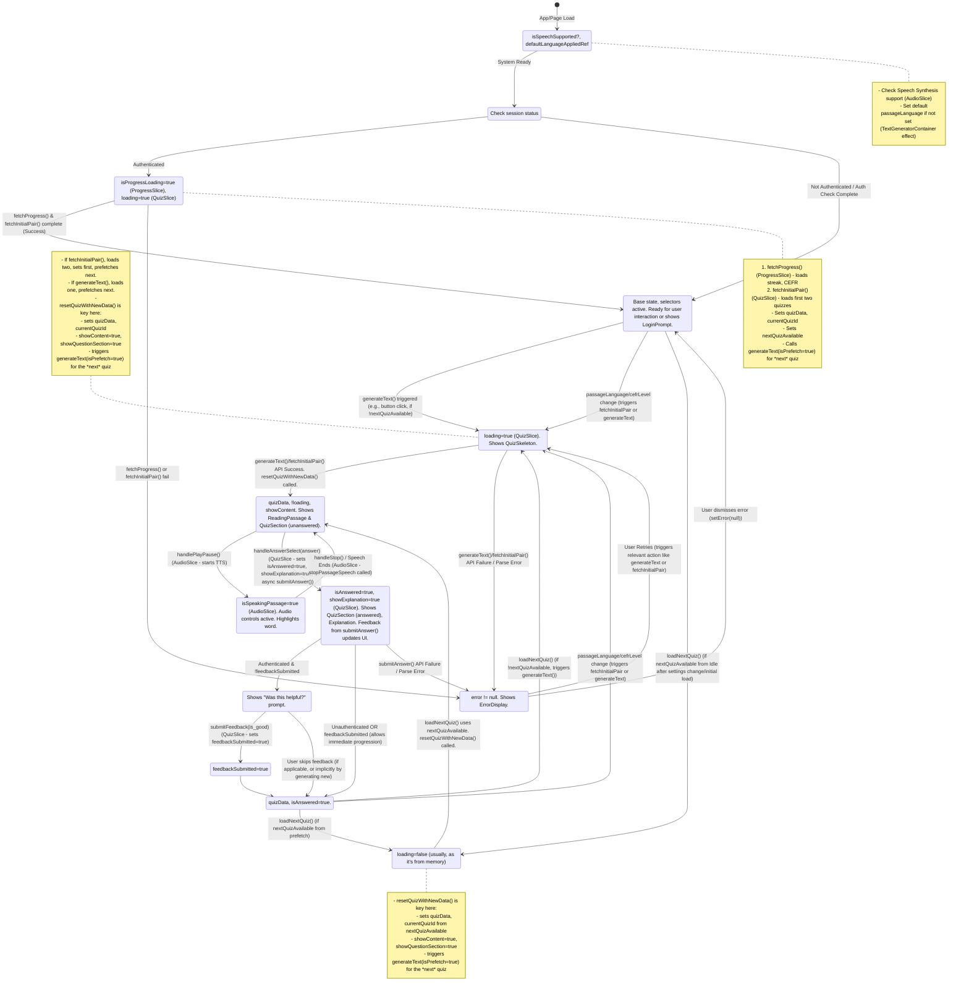

```mermaid
stateDiagram-v2
    [*] --> Initializing : App/Page Load

    Initializing --> AuthCheck : System Ready
    Initializing : isSpeechSupported?, defaultLanguageAppliedRef
    note right of Initializing
        - Check Speech Synthesis support (AudioSlice)
        - Set default passageLanguage if not set (TextGeneratorContainer effect)
    end note

    AuthCheck --> FetchingInitialData : Authenticated
    AuthCheck --> Idle : Not Authenticated / Auth Check Complete
    AuthCheck : Check session status

    FetchingInitialData : isProgressLoading=true (ProgressSlice), loading=true (QuizSlice)
    FetchingInitialData --> Idle : fetchProgress() & fetchInitialPair() complete (Success)
    FetchingInitialData --> Error : fetchProgress() or fetchInitialPair() fail
    note right of FetchingInitialData
        1. fetchProgress() (ProgressSlice) - loads streak, CEFR
        2. fetchInitialPair() (QuizSlice) - loads first two quizzes
           - Sets quizData, currentQuizId
           - Sets nextQuizAvailable
           - Calls generateText(isPrefetch=true) for *next* quiz
    end note

    Idle : Base state, selectors active. Ready for user interaction or shows LoginPrompt.
    Idle --> GeneratingNewContent : generateText() triggered (e.g., button click, if !nextQuizAvailable)
    Idle --> GeneratingNewContent : passageLanguage/cefrLevel change (triggers fetchInitialPair or generateText)
    Idle --> LoadingNextContentFromCache : loadNextQuiz() (if nextQuizAvailable from Idle after settings change/initial load)

    GeneratingNewContent : loading=true (QuizSlice). Shows QuizSkeleton.
    GeneratingNewContent --> DisplayingContent : generateText()/fetchInitialPair() API Success. resetQuizWithNewData() called.
    GeneratingNewContent --> Error : generateText()/fetchInitialPair() API Failure / Parse Error
    note left of GeneratingNewContent
        - If fetchInitialPair(), loads two, sets first, prefetches next.
        - If generateText(), loads one, prefetches next.
        - resetQuizWithNewData() is key here:
            - sets quizData, currentQuizId
            - showContent=true, showQuestionSection=true
            - triggers generateText(isPrefetch=true) for the *next* quiz
    end note

    LoadingNextContentFromCache : loading=false (usually, as it's from memory)
    LoadingNextContentFromCache --> DisplayingContent : loadNextQuiz() uses nextQuizAvailable. resetQuizWithNewData() called.
    note right of LoadingNextContentFromCache
        - resetQuizWithNewData() is key here:
            - sets quizData, currentQuizId from nextQuizAvailable
            - showContent=true, showQuestionSection=true
            - triggers generateText(isPrefetch=true) for the *next* quiz
    end note

    DisplayingContent : quizData, !loading, showContent. Shows ReadingPassage & QuizSection (unanswered).
    DisplayingContent --> SpeakingPassage : handlePlayPause() (AudioSlice - starts TTS)
    DisplayingContent --> AwaitingFeedback : handleAnswerSelect(answer) (QuizSlice - sets isAnswered=true, showExplanation=true, async submitAnswer())

    SpeakingPassage : isSpeakingPassage=true (AudioSlice). Audio controls active. Highlights word.
    SpeakingPassage --> DisplayingContent : handleStop() / Speech Ends (AudioSlice - stopPassageSpeech called)

    AwaitingFeedback : isAnswered=true, showExplanation=true (QuizSlice). Shows QuizSection (answered), Explanation. Feedback from submitAnswer() updates UI.
    AwaitingFeedback --> SubmittingFeedbackPrompt : Authenticated & !feedbackSubmitted
    AwaitingFeedback --> ReadyForNext : Unauthenticated OR feedbackSubmitted (allows immediate progression)
    AwaitingFeedback --> Error : submitAnswer() API Failure / Parse Error

    SubmittingFeedbackPrompt : Shows "Was this helpful?" prompt.
    SubmittingFeedbackPrompt --> FeedbackSubmitted : submitFeedback(is_good) (QuizSlice - sets feedbackSubmitted=true)
    SubmittingFeedbackPrompt --> ReadyForNext : User skips feedback (if applicable, or implicitly by generating new)

    FeedbackSubmitted : feedbackSubmitted=true
    FeedbackSubmitted --> ReadyForNext

    ReadyForNext : quizData, isAnswered=true.
    ReadyForNext --> LoadingNextContentFromCache : loadNextQuiz() (if nextQuizAvailable from prefetch)
    ReadyForNext --> GeneratingNewContent : loadNextQuiz() (if !nextQuizAvailable, triggers generateText())
    ReadyForNext --> GeneratingNewContent : passageLanguage/cefrLevel change (triggers fetchInitialPair or generateText)

    Error : error != null. Shows ErrorDisplay.
    Error --> Idle : User dismisses error (setError(null))
    Error --> GeneratingNewContent : User Retries (triggers relevant action like generateText or fetchInitialPair)
```
