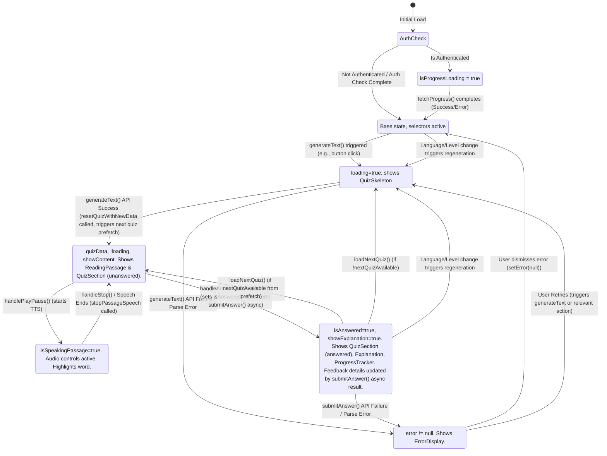

```mermaid
stateDiagram-v2
    [*] --> AuthCheck : Initial Load

    AuthCheck --> FetchingProgress : Is Authenticated
    AuthCheck --> Idle : Not Authenticated / Auth Check Complete

    FetchingProgress : isProgressLoading = true
    FetchingProgress --> Idle : fetchProgress() completes (Success/Error)

    Idle : Base state, selectors active
    Idle --> LoadingGeneration : generateText() triggered (e.g., button click)
    Idle --> LoadingGeneration : Language/Level change triggers regeneration

    LoadingGeneration : loading=true, shows QuizSkeleton
    LoadingGeneration --> DisplayingContent : generateText() API Success (resetQuizWithNewData called, triggers next quiz prefetch)
    LoadingGeneration --> Error : generateText() API Failure / Parse Error

    DisplayingContent : quizData, !loading, showContent. Shows ReadingPassage & QuizSection (unanswered).
    DisplayingContent --> SpeakingPassage : handlePlayPause() (starts TTS)
    DisplayingContent --> DisplayingFeedback : handleAnswerSelect(answer) (sets isAnswered=true, starts submitAnswer() async)

    SpeakingPassage : isSpeakingPassage=true. Audio controls active. Highlights word.
    SpeakingPassage --> DisplayingContent : handleStop() / Speech Ends (stopPassageSpeech called)

    DisplayingFeedback : isAnswered=true, showExplanation=true. Shows QuizSection (answered), Explanation, ProgressTracker. Feedback details updated by submitAnswer() async result.
    DisplayingFeedback --> DisplayingContent : loadNextQuiz() (if nextQuizAvailable from prefetch)
    DisplayingFeedback --> LoadingGeneration : loadNextQuiz() (if !nextQuizAvailable)
    DisplayingFeedback --> LoadingGeneration : Language/Level change triggers regeneration
    DisplayingFeedback --> Error : submitAnswer() API Failure / Parse Error

    Error : error != null. Shows ErrorDisplay.
    Error --> Idle : User dismisses error (setError(null))
    Error --> LoadingGeneration : User Retries (triggers generateText or relevant action)


    %% --- State Derivations & UI Notes ---
    %% UI Components shown based on state combinations:
    %% - LoginPrompt: Idle (if !authenticated, depends on showLoginPrompt)
    %% - QuizSkeleton: LoadingGeneration
    %% - ReadingPassage, QuizSection: DisplayingContent, DisplayingFeedback
    %% - ProgressTracker: DisplayingFeedback (or Idle if !quizData?) - Revisit ProgressTracker visibility condition
    %% - ErrorDisplay: Error
    %% - AudioControls: Active during SpeakingPassage, potentially visible DisplayingContent

    %% --- Underlying Store Slices (Zustand: useTextGeneratorStore) ---
    %% - uiSlice: loading, error, showContent, showExplanation, showQuestionSection
    %% - quizSlice: quizData, currentQuizId, selectedAnswer, isAnswered, feedback*, generateText(), handleAnswerSelect(), loadNextQuiz(), nextQuizAvailable
    %% - audioSlice: isSpeakingPassage, isPaused, currentWordIndex, handlePlayPause(), handleStop(), speakText()
    %% - settingsSlice: passageLanguage, cefrLevel (influence generateText params)
    %% - progressSlice: isProgressLoading, userStreak, fetchProgress()
```
