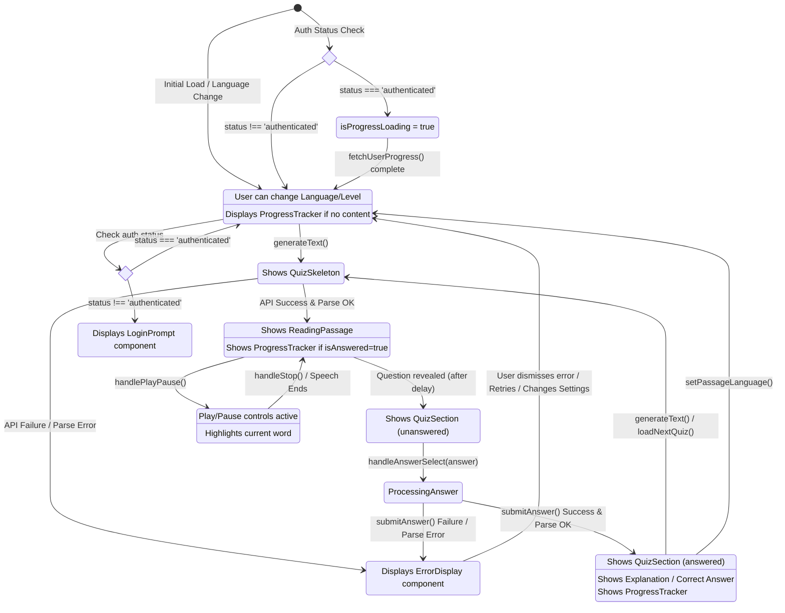

```mermaid
stateDiagram
    [*] --> Idle : Initial Load / Language Change
    Idle --> LoadingGeneration : generateText()
    Idle : User can change Language/Level
    Idle : Displays ProgressTracker if no content

    LoadingGeneration --> DisplayingContent : API Success & Parse OK
    LoadingGeneration --> Error : API Failure / Parse Error
    LoadingGeneration : Shows QuizSkeleton

    DisplayingContent --> AwaitingAnswer : Question revealed (after delay)
    DisplayingContent --> SpeakingPassage : handlePlayPause()
    DisplayingContent : Shows ReadingPassage
    DisplayingContent : Shows ProgressTracker if isAnswered=true

    SpeakingPassage --> DisplayingContent : handleStop() / Speech Ends
    SpeakingPassage : Play/Pause controls active
    SpeakingPassage : Highlights current word

    AwaitingAnswer --> ProcessingAnswer : handleAnswerSelect(answer)
    AwaitingAnswer : Shows QuizSection (unanswered)

    ProcessingAnswer --> DisplayingFeedback : submitAnswer() Success & Parse OK
    ProcessingAnswer --> Error : submitAnswer() Failure / Parse Error

    DisplayingFeedback --> LoadingGeneration : generateText() / loadNextQuiz()
    DisplayingFeedback --> Idle : setPassageLanguage()
    DisplayingFeedback : Shows QuizSection (answered)
    DisplayingFeedback : Shows Explanation / Correct Answer
    DisplayingFeedback : Shows ProgressTracker

    Error --> Idle : User dismisses error / Retries / Changes Settings
    Error : Displays ErrorDisplay component

    state if_authenticated <<choice>>
    [*] --> if_authenticated : Auth Status Check
    if_authenticated --> FetchingProgress : status === 'authenticated'
    if_authenticated --> Idle : status !== 'authenticated'
    FetchingProgress : isProgressLoading = true
    FetchingProgress --> Idle : fetchUserProgress() complete

    state if_login_prompt <<choice>>
    Idle --> if_login_prompt: Check auth status
    if_login_prompt --> ShowLoginPrompt : status !== 'authenticated'
    if_login_prompt --> Idle : status === 'authenticated'
    ShowLoginPrompt : Displays LoginPrompt component


    %% --- Implementation Notes ---
    %% Underlying state managed by Zustand store (useTextGeneratorStore)
    %% Store logic organized into slices:
    %% - uiSlice: loading, error, UI flags (showContent, showExplanation...)
    %% - quizSlice: quizData, answers, feedback, generation/submission logic
    %% - audioSlice: text-to-speech state and controls
    %% - settingsSlice: language, cefrLevel preferences
    %% - progressSlice: userStreak, progress fetching

    %% --- Original Notes on specific state variables influencing view ---
    %% loading (uiSlice): Controls QuizSkeleton visibility
    %% quizData (quizSlice), showContent (uiSlice): Control main content visibility
    %% isAnswered (quizSlice): Controls ProgressTracker visibility, QuizSection state
    %% isSpeakingPassage, isPaused (audioSlice): Control AudioControls state
    %% error (uiSlice): Controls ErrorDisplay visibility
    %% showLoginPrompt (uiSlice): Controls LoginPrompt visibility (derived from auth status)
```
